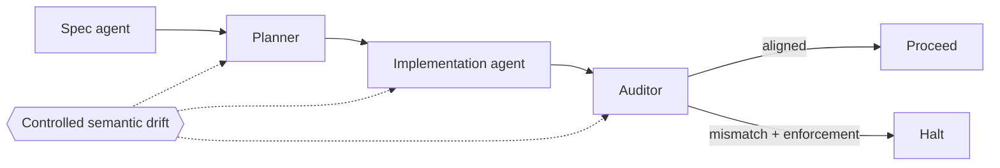

<div align="center">

# sema-evals

**Open, causal evaluations for content-addressed semantics and multi-agent coordination.**

_When meaning changes, do agents notice before they act?_

[](https://github.com/RobinOppenstam/sema-evals/actions/workflows/ci.yml)
[](LICENSE)
[](package.json)
[](docs/RESEARCH_PLAN.md)

[Quick start](#quick-start) · [First experiment](#babel-relay) · [Research plan](docs/RESEARCH_PLAN.md) · [Contributing](CONTRIBUTING.md)

</div>

---

`sema-evals` is an independent companion to
[Sema](https://github.com/emergent-wisdom/sema), the content-addressed semantic
protocol for agent coordination.

It investigates one deliberately narrow question:

> Does content-addressed, fail-closed semantic alignment reduce silent
> coordination failures **after controlling for instruction quality**?

The distinction matters. A good Pattern Card may improve an agent because its
instructions are good. A hash may detect that two definitions differ. A runtime
may prevent execution after detecting that difference. Those are three separate
effects, and this project measures them separately.

## Babel Relay

The first runnable experiment passes a small contract through four boundaries
and injects one controlled semantic mutation—such as `>=` becoming `>`, six
token decimals becoming eighteen, or one retry becoming two.



Every fixture runs through the same five-condition ladder:

| Condition                               | Isolated comparison                    |
| --------------------------------------- | -------------------------------------- |
| **Task-only natural language**          | Ordinary baseline                      |
| **Equal-information prose**             | Benefit of the semantic content itself |
| **Opaque ID + resolver**                | Lookup and wire-compression control    |
| **Content-addressed + voluntary check** | Drift detection without enforcement    |
| **Content-addressed + enforced check**  | Fail-closed runtime enforcement        |

The default backend uses deterministic fixture references. It validates the
experiment mechanics, objective scorer, paired randomization, and result
pipeline. An optional adapter generates references through the official
`semahash` Python package; neither mode is an empirical claim that Sema improves
model performance. Model-driven agents and registry handshakes are the next
milestone.

## Quick start

Requirements: Node.js 22+ and pnpm 10+.

```bash
git clone https://github.com/RobinOppenstam/sema-evals.git
cd sema-evals
pnpm install
pnpm check
pnpm experiment:babel
```

Run five paired repetitions with a recorded order seed:

```bash
pnpm experiment:babel -- --seeds 5 --order-seed 20260714
```

Use official Sema v0.3 canonicalization from an adjacent upstream checkout:

```bash
pnpm experiment:babel -- \
  --semantic-backend sema-python \
  --sema-python ../sema/.venv/bin/python \
  --seeds 5
```

The selected Python interpreter must have `semahash>=0.3.0,<0.4.0` installed.
The adapter deliberately fails closed outside the audited 0.3.x line rather
than guessing which canonicalization a future release uses. Its package and
canonicalization versions are written into every result manifest. The
TypeScript harness does not reimplement or approximate Sema hashing.

The command produces a complete, ignored result bundle:

```text
results/babel-relay/<run-id>/
├── manifest.json    # environment, protocol, model, and data fingerprints
├── trials.jsonl     # one lossless record per trial
├── summary.json     # machine-readable aggregates
└── summary.md       # human-readable condition comparison
```

## What gets measured

Outcome metrics:

- silent semantic-divergence rate;
- correct and false halt rates;
- final task success;
- detection boundary and repair outcome;
- variance across paired repetitions.

Cost metrics remain separate:

- bytes transmitted on the wire;
- bytes or tokens hydrated by a resolver;
- cached and uncached model input tokens;
- output and reasoning tokens when available;
- tool calls, latency, retries, and monetary cost.

A four-character reference may compress a message while the full definition
still enters model context. `sema-evals` never treats those as the same saving.

## Repository map

```text
packages/
├── core/             versioned schemas, fingerprints, paired matrix runner
├── adapters/         provider-neutral agents + official Sema Python bridge
└── reporters/        JSONL, JSON, and Markdown result bundles

experiments/
├── babel-relay/      runnable controlled semantic-drift experiment
├── sema-tax/         pattern-count and hydration break-even curve
├── security/         mutation-backed smart-contract evaluation
├── forecasting/      historical five-agent forecast council
└── x402-contract-drift/ payment and delegation semantics

docs/
├── RESEARCH_PLAN.md
├── EXPERIMENT_STANDARD.md
└── adr/              durable research and architecture decisions

schemas/              generated public JSON Schemas
results/              local generated artifacts, ignored by default
```

## Research roadmap

| Phase | Deliverable                                  | Primary endpoint               | Status          |
| ----- | -------------------------------------------- | ------------------------------ | --------------- |
| 0     | Reproducible evaluator + deterministic relay | Scorer correctness             | **Live**        |
| 1     | Official hashing + model-driven Babel Relay  | Silent-divergence rate         | **In progress** |
| 2     | Sema tax and hydration curve                 | Success per total token        | Planned         |
| 3     | A2A semantic extension                       | Execution under registry drift | Planned         |
| 4     | `sema-sec` Solidity trials                   | Recall at fixed FP budget      | Planned         |
| 5     | Historical forecast council                  | Brier score                    | Planned         |

The full sequence and exit gates are locked in the
[research plan](docs/RESEARCH_PLAN.md). Material changes require an architecture
decision record rather than silently moving the goalposts.

## Experiment contract

Evidence published from this repository should satisfy these constraints:

1. Choose one primary endpoint before a confirmatory run.
2. Give causal controls identical semantic information, tools, and budgets.
3. Run every condition on the same scenario and seed blocks.
4. Record the condition-order randomization seed.
5. Prefer executable validators over subjective judging.
6. Preserve malformed outputs, failures, timeouts, and exclusions.
7. Fingerprint code, prompts, fixtures, models, Sema, and dependency locks.
8. Publish negative results and uncertainty—not only winning examples.

See the complete [experiment standard](docs/EXPERIMENT_STANDARD.md).

## Working with upstream Sema

This repository does not fork or silently patch the protocol. During local
development, the repositories can sit side by side:

```text
projects/opensource/
├── sema/          upstream protocol checkout
└── sema-evals/    independent experiments and evidence
```

Potential Pattern Cards, conformance vectors, or protocol integrations can be
proposed upstream after they have focused tests and maintainer alignment.

## Contributing

Small, falsifiable additions are preferred over large agent demos. Good first
contributions include:

- a new Babel Relay mutation plus a clean control;
- an objective scorer invariant;
- an official Sema resolver adapter;
- a provider adapter that preserves raw responses and usage telemetry;
- cross-language canonicalization test vectors;
- reproducible analysis or visualization of an existing result bundle.

Read [CONTRIBUTING.md](CONTRIBUTING.md) and
[AGENTS.md](AGENTS.md) before opening a change.

## License and attribution

Code in this repository is MIT licensed. Sema vocabulary, documentation, or
other content copied or derived here remains subject to Sema's CC BY 4.0
content license. See [NOTICE](NOTICE).

`sema-evals` is independent research infrastructure and is not an official Sema
release.
